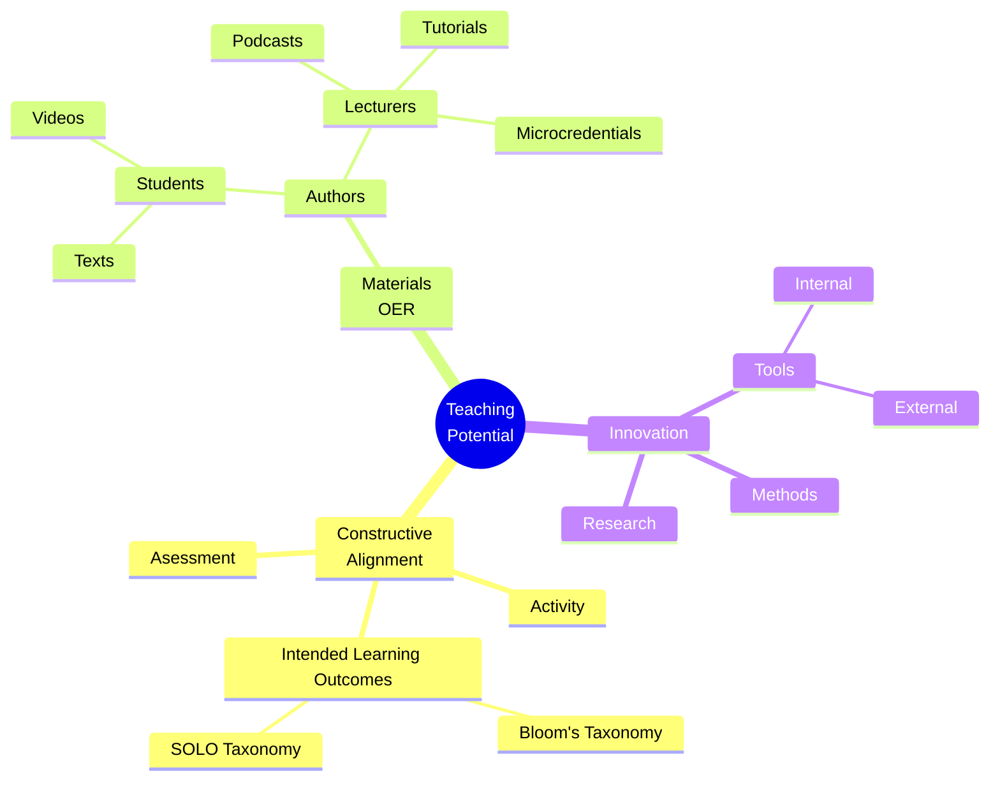
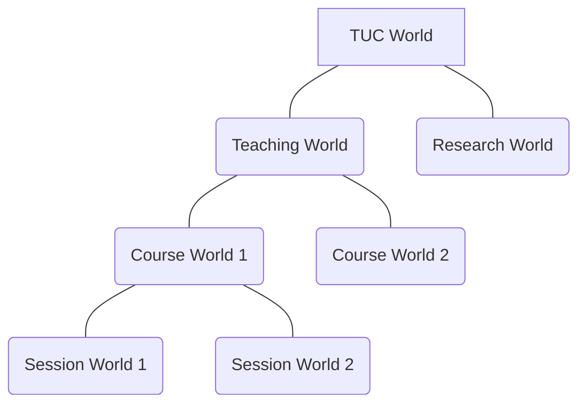

# Bonus material

## Teaching

### Meta-principles

> Teaching/learning at university is an interaction. It is:

```ascii
                   .------------.   
                  ( Intellectual ) 
                   '--+------+--'  
                     /        \
     .--------------+-.      .-+----------.
    (  Transformative  )----(  Authentic   )
     '----------------'      '------------'
```
### Mindmap



### flowchart



### Potential List

- All courses:
  - are onstructively aligned (Activity, ILO, Assessment)
    - have Intended Learning Outcomes (ILO)
      - Bloom
      - SOLO
  - have products
    - Papers
    - Posters
    - Presentations
    - Podcasts
    - Videos
  - have the potential to be:
    - OER (Open Educational Resources)
      - generated by lecturer
      - generated by students
    - microcredentials
      - university students
      - university staff
    - integrated into other courses (formality scale)
      - internally (wiki)
      - internationally (COIL)
    - testing grounds for innovation (leading to research)
      - external tools and methods
      - internal tools and methods
      - all the above points

### Teaching World

