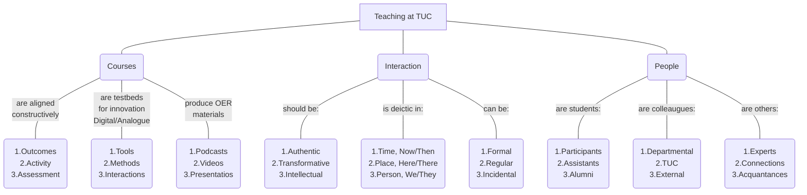

<!--
author:   Mark Jacob
email:    markjjacob@hotmail.com
version:  0.1.0
language: en
narrator: US English Female

comment:  This simple description of your course.
          Multiline is also okay.

icon: https://www.tu-chemnitz.de/phil/english/iaa/priaa/priaaimages/Flyer%20TU%20Chemnitz_2.jpg

import: https://raw.githubusercontent.com/liaScript/mermaid_template/master/README.md

link:     https://cdn.jsdelivr.net/chartist.js/latest/chartist.min.css

script:   https://cdn.jsdelivr.net/chartist.js/latest/chartist.min.js

translation: Français translations/French.md
-->

# Teaching

1. [Preliminaries](#preliminaries)
2. [Principles](#principles)
3. [Potential](#potential)

## Preliminaries

??[interview](https://www.etymonline.com/search?q=interview)

### Basingstoke

{{0-1}}

#### Basingstoke in Shakespeare

??[shakespeare](https://www.folger.edu/explore/shakespeares-works/henry-iv-part-2/read/2/1/?q=Basingstoke#line-2.1.177)

## Principles

{{0-1}}

What's the biggest [[ problem ]] you have right now at university?

{{1}}
> **Principle 1:**
> Don't ask questions you know the answer to.
> *What's the biggest problem you have right now at uni?*
>
> **Next level:** Let students answer their own questions.
> *What's the biggest ............ you have right now at uni?*

{{2}}
> **Principle 2:**
> If students can play your role, give them the opportunity.
> *Please lead the discussion.*
>
> **Next level:** Let students contribute to shaping the session.
> *What are our goals today and how are we going to reach them?*

{{3}}
> **Principle 3:**
> Give constructive and actionable feedback.
> *Make sure you finish strongly.*
>
> **Next level:** Give them the chance to try again.
> *This time thank the participants and officially give the word back to me.*

### Principles Survey

> How important do you rate the principles?

[[Low][Medium][High]]
[         ] Don't ask students questions you know the answer to.
[         ] If students can play your role, give them the opportunity.
[         ] Give students constructive and actionable feedback.

### Principles Survey 2

> Do these principles feature in your teaching?

[[Yes][No]]
[         ] Don't ask students questions you know the answer to.
[         ] If students can play your role, give them the opportunity.
[         ] Give students constructive and actionable feedback.

### Bonus Principles

{{1}}
> **Bonus Principle 1:**
> Take records.
> *How many of you agree with the statement?*
>
> **Next level:** Work scientifically.
> *Observation, Hypothesis, Experimentation, Data analysis, Conclusion*

{{2}}
> **Bonus Principle 2:**
> Experience don't perform.
>
> **Next level:** Reflect don't judge.

## Potential

