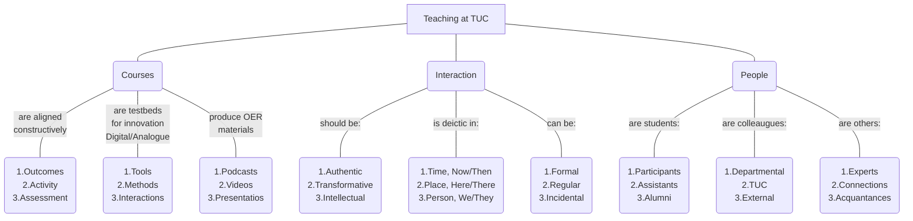

<!--
author:   Mark Jacob
email:    markjjacob@hotmail.com
version:  0.1.0
language: en
narrator: US English Female

comment:  This simple description of your course.
          Multiline is also okay.

icon: https://www.tu-chemnitz.de/phil/english/iaa/priaa/priaaimages/Flyer%20TU%20Chemnitz_2.jpg

import: https://raw.githubusercontent.com/liaScript/mermaid_template/master/README.md

link:     https://cdn.jsdelivr.net/chartist.js/latest/chartist.min.css

script:   https://cdn.jsdelivr.net/chartist.js/latest/chartist.min.js

translation: Français translations/French.md

-->

# Teaching

1. [Background](#background)
2. [Principles](#principles)
3. [Tools](#tools)

## Background

    {{0-1}}
> Hallo everyone, I'm chuffed to be here! I have great memories of the last time I came to Chemnitz. No I'm not talking about Christina'S Forschungskolloquium last January, although that was a very enjoyable experience. I last came to Chemnitz on Sunday for Jugend Musiziert - my 12-year-old son played Schubert and Martinu on the violin as a duet with a promising young pianist. The weekend before I hopped on the train and went to SMAC so Chemnitz is just a stone's throw away for me especially as I live by the railway station in Freiberg.

    {{1-2}}
> But back to today. What would be great to do today would be to build a world, to coconstruct a reality in which we are colleagues, working together, teaching together, researching together. In this world I would like us to feel excited: excited about the potential in TUC for the ideas I'm showing you, excited about the potential use and further development in Chemnitz of the innovative tools and technologies I'll share with you today, excited about the prospect of interacting with each other in meaningful ways. At the same time I would like us to feel safe in this world, safe in the knowledge that my teaching is founded on solid principles, safe in the knowledge that the students are not just satisfied but also enthusiastic and engaged, safe in the knowledge that you have another reliable character in the team.

    {{2-3}}
> So before we experience those feelings of excitement and safety, let's get a bit of background info on the character that you so far don't know too much about. Let's turn to the mainstream media to see what we can find out:

    {{3-4}}
??[mdr](https://www.mdr.de/nachrichten/sachsen/chemnitz/freiberg/europaserie-erasmus-brite-in-freiberg-100.html)

    {{4-5}}

**Des polytechniciens dans les F.N.F.L.**
La plupart des X rejoignant les FNFL sont des ingénieurs du Génie Maritime quittant les arsenaux métropolitains, tels Albert LOZACHMEUR (X1936), parti de Brest le 18 juin 1940, ou Victor AUDREN (X1937), parti avec 140 personnes de la poudrerie du Moulin Blanc. Tous deux participèrent aux opérations de remise en état des bâtiments navals conduites en 1940-41.

    {{5-6}}

    {{6}}
??[shakespeare](https://www.folger.edu/explore/shakespeares-works/henry-iv-part-2/read/2/1/?q=Basingstoke#line-2.1.177)

## Principles

    {{0-1}}
What's the biggest [[ problem ]] you have right now at university?

    {{1}}
> **Principle 1:**
> Ask questions you don't know the answer to.
> *What's the biggest problem you have right now at uni?*
>
> **Next level:** Let students answer their own questions.
> *What's the biggest ............ you have right now at uni?*

    {{2}}
> **Principle 2:**
> If students can play your role, give them the opportunity.
> *Please lead the discussion.*
>
> **Next level:** Let students contribute to shaping the session.
> *What are our goals today and how are we going to reach them?*
    {{3}}
> **Principle 3:**
> Give constructive and actionable feedback.
> *Make sure you finish strongly.*
>
> **Next level:** Give them the chance to try again.
> *This time thank the participants and officially give the word back to me.*

### Principles Survey 1

> How important do you rate the principles?

[(Low)(Medium)(High)]
[         ] Ask students questions you don't know the answer to.
[         ] If students can play your role, give them the opportunity.
[         ] Give students constructive and actionable feedback.

### Principles Survey 2

> Do these principles feature in your teaching?

[(Always)(Often)(Sometimes)(Rarely)(Never)]
[         ] Ask students questions you don't know the answer to.
[         ] If students can play your role, give them the opportunity.
[         ] Give students constructive and actionable feedback.

### Bonus Principles

    {{1}}
> **Bonus Principle 1:**
> Take records.
> *How many of you agree with the statement?*
>
> **Next level:** Work scientifically.
> *Observation, Hypothesis, Experimentation, Data analysis, Conclusion*

    {{2}}
> **Bonus Principle 2:**
> ...
>
> **Next level:** ...

## Student satisfaction

    {{0-1}}
https://bildungsportal.sachsen.de/opal/auth/RepositoryEntry/35930112002/CourseNode/1656556056424095009

    {{1-2}}
<iframe src="https://video.tu-freiberg.de/media/embed?key=ae6aba5534dc8ffacedf64759cc6a30c&width=560&height=315&autoplay=false&controls=true&autolightsoff=false&loop=false&chapters=false&playlist=false&related=false&responsive=false&t=3471" data-src="" class="iframeLoaded" width="560" height="315" frameborder="0" allowfullscreen="allowfullscreen" allowtransparency="true" scrolling="no" aria-label="media embed code" style=""></iframe>

    {{2}}
- Excellent course evaluation (The Language of Negotiation Summer Semester 2022)
- Special Christmas 2022 mention from StuRa
- Relatively high numbers of continuing students

## Tools

### LiaScript

??[live lia doc](https://liascript.github.io/LiveEditor/?/edit/TNcJ6RnYbjgs286JCYVpAmDA/webrtc)

### Instructor creates LiaScript course

??

### Students create LiaScript content

??

### Students create Wikis

https://bildungsportal.sachsen.de/opal/auth/RepositoryEntry/41133408259/CourseNode/1705289529591047006/wiki/Index

## General Ideas for teaching at TUC

## Videos 1

!?[alt-text](https://www.youtube.com/watch?v=RzvCK33lKFA "Fit in 15")
!?[alt-text](https://video.tu-freiberg.de/video/Fit-in-English-28Geophysics29/55d2e3c431cd9c5db0516ed61d976971 "Fit in English - Geophysics")
!?[alt-text](https://video.tu-freiberg.de/video/Its-worth-it/1d25641fa3663a45440b0dcb6a98b2ee "It's Worth It!")
!?[alt-text](https://www.youtube.com/watch?v=6FPLuPPhzHw "Alex is Back!")
infoinfo

## Videos 2

!?[alt-text](https://video.tu-freiberg.de/video/IEP-1-Introducing-yourself/4349372d9d69e2415729b1a3a2fab941 "Introducing yourself")

!?[alt-text](https://video.tu-freiberg.de/video/IEP-2-Introducing-your-topic/5978d19af08232dfa88c03cb7ad2a14f "Introducing your topic")

!?[alt-text](https://video.tu-freiberg.de/video/IEP-3-Synonyms/c2230053b26249e624c2476f8c7a409a "Synonyms")

!?[alt-text](https://video.tu-freiberg.de/video/IEP-4-Useful-phrases/3bebb19a2d1f9c8fa2a6c4d338134561 "Useful Phrases")

!?[alt-text](https://video.tu-freiberg.de/video/IEP-5-Nerves/89bf38bd9dc6eb725746648b05e67c75 "Nerves")

!?[alt-text](https://video.tu-freiberg.de/video/IEP-6-Non2Dverbal-communication-p1/d5b08cd5a5b7ffcd076acfcf29fa1b30 "Non-verbal communication 1")

!?[alt-text](https://video.tu-freiberg.de/video/IEP-6-Non2Dverbal-communication-p2/892ed954c1bb2fc53f5a6efaf97f0e4f "Non-verbal communication 2")

!?[alt-text](https://video.tu-freiberg.de/video/IEP-7-Conclusion/04a93eca656810677743ff2488fda44b "Conclusion")

!?[alt-text](https://video.tu-freiberg.de/video/IEP-8-Questions/e87b984068e6be6ac2d41d9941e133dd "Questions")

